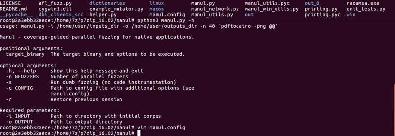

# Manul


Manul is a coverage-guided parallel fuzzer for open-source and blackbox binaries on Windows, Linux and MacOS (beta) written in pure Python.

# Quick Start
```
pip3 install psutil
git clone https://github.com/mxmssh/manul
cd manul
mkdir in
mkdir out
echo "AAAAAA" > in
python3 manul.py -i in -o out -n 4 "linux/test_afl @@"
```

# List of Public CVEs

| CVE IDs                                      | Product  | Finder         |
|----------------------------------------------|----------|----------------|
| CVE-2019-6931 CVE-2019-7310 CVE-2019-9959    | Poppler  | Maksim Shudrak |
| CVE-2018-17019 CVE-2018-16807 CVE-2019-12175 | Bro/Zeek | Maksim Shudrak |

If you managed to find a new bug using Manul please contact me and I will add you on the list.

# Demo



# Dependencies
1. psutil
2. Python 2.7 or Python 3.5 (prefered)

# Coverage-guided fuzzing

Currently, Manul supports two types of instrumentation: afl-gcc and DBI.

## Coverage-guided fuzzing (AFL instrumentation mode)

Instrument your target with ```afl-gcc``` and ```Address Sanitizier``` (recommended for better results). For example:
```
CC=afl-gcc CXX=afl-g++ CFLAGS=-fsanitize=address CXXFLAGS=-fsanitize=address cmake <path_to_your_target>
make -j 8
```

See [this instruction](http://lcamtuf.coredump.cx/afl/QuickStartGuide.txt) for more details.

## Coverage-guided fuzzing (DBI mode)

You don't need to instrument your target in this mode but you need to download the latest version of DynamoRIO framework for Windows or Linux. The working version of Intel PIN is provided with Manul. You can find it in the ```dbi_clients_src/pin/pin-3.6-97554-g31f0a167d-gcc-linux``` folder.

Manul is distributed with x86/x64 pre-compiled clients for Linux and Windows. You can find them in the following folders:
```
linux/dbi_32|dbi_64/afl-pin.so (Intel PIN client)
linux/dbi_32|dbi_64/libbinafl.so (DynamoRIO client)
win/dbi_32|dbi_64/binafl.dll
```
Unfortunately, DynamoRIO is not officially supported on OS X. Intel PIN client on OS X is not yet ported.

### Using DynamoRIO to fuzz blackbox binaries

You can find DynamoRIO release packages at [DynamoRIO download page](https://github.com/DynamoRIO/dynamorio/releases). Choose one of the archive available such as:

DynamoRIO-i386-Linux-7.91.18103-0.tar.gz - 32bit Linux.

DynamoRIO-x86_64-Linux-7.91.18103-0.tar.gz - 64bit Linux.

DynamoRIO-Windows-7.91.18103-0.zip - 32/64bit Windows.

You have to uncomment the following lines in the ```manul.config``` file and provide correct path to DynamoRIO launcher and client.

```
# Choose DBI framework to provide coverage back to Manul ("dynamorio" or "pin"). Example dbi = dynamorio
dbi = dynamorio
# If dbi parameter is not None the path to dbi engine launcher and dbi client should be specified.
dbi_root = /home/max/DynamoRIO/bin64/drrun
dbi_client_root = /home/max/manul/linux/dbi_64/libbinafl.so
dbi_client_libs = None
```

IMPORTANT NOTE: you should use 32bit launcher and 32bit client to fuzz 32bit binaries and 64bit launcher and 64bit client for 64bit binaries!

### Using Intel PIN to fuzz blackbox binaries on Linux

TBD

# Command-Line Arguments

The most frequently used options can be provided via the command line. The more options are supported using configuration file (```manul.config```).

```
Example: python3 manul.py -i corpus -o out_dir -n 40 "target @@"

positional arguments:
  target_binary  The target binary and options to be executed (don't forget to include quotes e.g. "target e @@").

optional arguments:
  -h, --help     show this help message and exit
  -n NFUZZERS    Number of parallel fuzzers
  -s             Run dumb fuzzing (no code instrumentation)
  -c CONFIG      Path to config file with additional options (see Configuration File Options section below)
  -r             Restore previous session

Required parameters:
  -i INPUT       Path to directory with initial corpus
  -o OUTPUT      Path to output directory

```

# Configuration File Options

Manul is distributed with default ```manul.config``` file where user can find all supported options and usage examples. Options should be specified in the following format ```Format: <option_name> = <value>```. Symbol ```#``` can be used to ignore a line.

#### Dictionary

```dict = /home/max/dictionaries/test.dict```. AFL mutation strategy allows user to specify a list of custom tokens that can be inserted at random places in the fuzzed file. Manul supports this functionality via this option (absolute paths prefered).

#### Mutator weights
```mutator_weights=afl:7,radamsa:2,my_mutator:1```. Mutator weights allow user to tell Manul how many mutations per 10 executions should be performed by certain fuzzer. In this example, AFL mutator will be executed in 7/10 mutations, Radamsa 2/10 and some custom ```my_mutator``` will get 1/10. If you want to disable certain mutator, the weight should be assigned to 0 (e.g. ```mutator_weights=afl:0,radamsa:1,my_mutator:9```).

#### Determenistic Seed (Radamsa Option)
```determenistic_seed = False|True```. By providing ```True```, Radamsa mutations will become determentistic thereby each run of Manul will lead to same outputs.

#### Print Summary per Thread
```print_per_thread = False|True```. By enabling this option, Manul will print summary for each thread being executed instead of total summary.

#### Disable Volatile Paths
```disable_volatile_bytes = False|True``` By enabling this option, Manul will not blacklist volatile paths.

#### DBI Options
```dbi = dynamorio|pin```. This option tells Manul which DBI framework will be used to instrument the target.

```dbi_root = <path>```. This options tells Manul where to find DBI framework main launcher.

```dbi_client_root = <path>```. This options tells Manul where to find DBI client to perform instrumentation.

```dbi_client_libs = name_#1,name_#2|None```. This option can be used to specify list of libraries that need to be instrumented along with the main target (e.g. you have executable that loads the target library where you want to find bugs).

#### Timeout
```timeout = 10```. Time to wait before kill the target and send the next test case.

#### Netslave and Netmaster Options

The options ```net_config_master``` and ```net_config_slave``` are used to distrubute manul instances over network. You have to perform the following 3 steps to run distributed fuzzing.
1. Create a file with a list of hosts in the following format: ```IP:port``` where your slaves will be executed. 
2. Start all Manul slave instances on remote machines (with all required options and path to target binary) and enable the following option:
```net_config_slave = 0.0.0.0:1337```. Manul will launch the instance and will wait for incoming connection from master instance on port 1337.
3. Start the master instance and provide the file with a list of slave instances created on Step 1 using ```net_config_master = file_name```.

#### Debug Mode
```debug = False|True``` - print debug info.

```logging_enable = False|True``` - save debug info in the log.

#### Logo
```manul_logo = False|True``` - print Manul logo at the beginning.

#### Disable Stats
```no_stats = False|True``` - save statistics.

#### Bitmap Syncronization Frequency (5000 recommended for DBI mode)
```sync_freq = 10000```. Allows user to change coverage bitmap syncronization frequency. This options tells Manul how often it should syncronize coverage between parallel fuzzing instances. Lower value decreases performance but increases coordination between instances.

#### Custom Path to Save Output
```#custom_path = test_path``` - this option allows to save the test case in the custom folder (if target wants to load it from some predefined place).

#### Command Line Fuzzing (experimental)
```cmd_fuzzing = True|False```. If this option is enabled, Manul will provide the input in the target via command line instead of saving in the file.

#### Ignore Signals
```user_signals = 6,2,1|None```. User can tell Manul which signals from the target should be ignored (not considered as crash).

#### Network Fuzzing (experimental)

```target_ip_port = 127.0.0.1:7715|None``` - used to spefiy target IP and PORT.
```target_protocol = tcp|tcp``` - used to spefify the protocol to send input in the target over network.
```net_init_wait = 1```. This option can be used to wait while the target is launching before actually start sending test cases.
```net_sleep_between_cases = 0.0```. This option can be used to define a delay between test cases being send in the target.

Currently, network fuzzing is an experimental feature (see issues for more details).

# Adding Custom Mutator 
Custom mutator can be added in the following three steps:
Step 1. Create a python (.py) file and give it some name (e.g. example_mutator.py)

Step 2. Create two functions ```def init(fuzzer_id)``` and ```def mutate(data)```. See [example_mutator](example_mutator.py) for more details. Manul will call ```init``` function during fuzzing initalization and ```mutate``` for each file being provided into the target.

Step 3. Enable mutator by specifying its name using ```mutator_weights``` in ```manul.config```. E.g. ```mutator_weights=afl:2,radamsa:0,example_mutator:8```.

NOTE: AFL and Radamsa mutators should always be specified. If you want to disable AFL and/or Radamsa just assign 0 weights to them.

## Technical Details
TBD

## Status Screen


